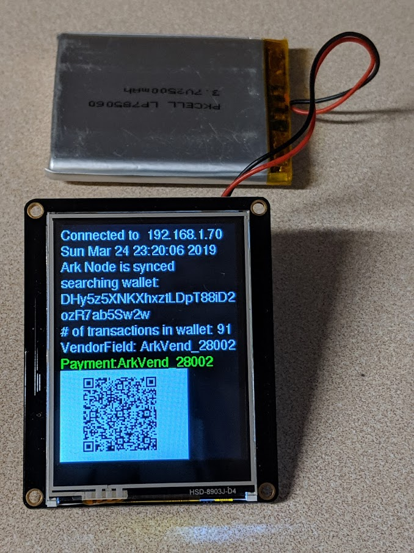

# Ark_Vend

Proof of Concept Project -work in progress.  

This projects illustrates a vending machine that accepts Ark Cryptocurrency for payment.
Basic program flow is working.

Program Features: 
This program has been tested with ESP32 Adafruit Huzzah however it should also work with ESP8266 modules with minor changes to hardware connections and wifi libraries.
This sketch will use the ARK Cpp-Client API to interact with an Ark V2 Devnet node.
Ark Cpp Client available from Ark Ecosystem <info@ark.io>
Ark API documentation:  https://docs.ark.io/sdk/clients/usage.html

Electronic Hardware Peripherals:
	Adafruit TFT FeatherWing 2.4" 320x240 Touchscreen
    
    

Description of the current program flow.  
-status/debug info is also regularly sent to serial terminal
1. configure peripherals
  -setup wifi and display connection status and IP address on TFT Screen
  -setup time sync with NTP server and display current time
  -check to see if Ark node is synced and display status
2. search through all received transactions on wallet. Wallet address is displayed
  -"searching wallet + page#" will be displayed. text will toggle between red/white every received transaction
3. number of transactions in wallet will be displayed
4. QR code with Vendor field = "ArkVend_(random number)" is generated
5. wallet is continually checked waiting for transaction with vendor field to be received.
6. If payment is received then it will display in green text "Payment: ArkVend_(random_number)"
