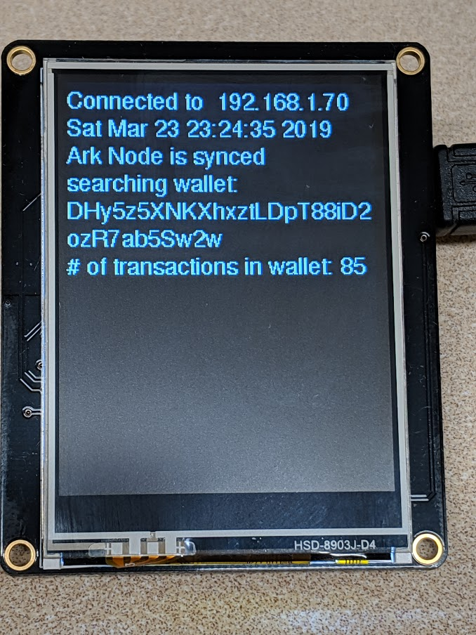

# Ark_Vend

Proof of Concept Project -work in progress.  

This projects illustrates a vending machine that accepts Ark Cryptocurrency for payment.(Not complete)

Program Features: 
This program has been tested with ESP32 Adafruit Huzzah however it should also work with ESP8266 modules with minor changes to hardware connections and wifi libraries.
This sketch will use the ARK Cpp-Client API to interact with an Ark V2 Devnet node.
Ark Cpp Client available from Ark Ecosystem <info@ark.io>
Ark API documentation:  https://docs.ark.io/sdk/clients/usage.html

Electronic Hardware Peripherals:
	Adafruit TFT FeatherWing 2.4" 320x240 Touchscreen
    
    

    
    
